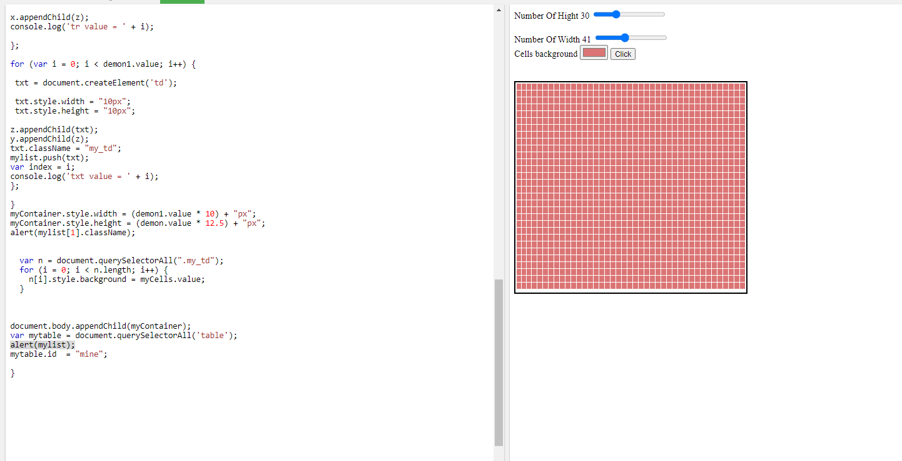
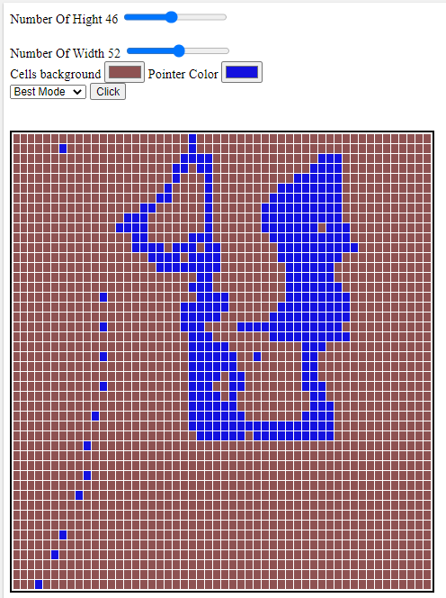

# Create-Table-Using-JS
enter 2 values hight and width of the table 

## version 1.2:

it can replce the table each time with new one 
I really Like this app if you didn't like it so you are noob can't understand it

## version 5:

## version 6:

## version 7:

On My server:
http://18.196.30.95/art
