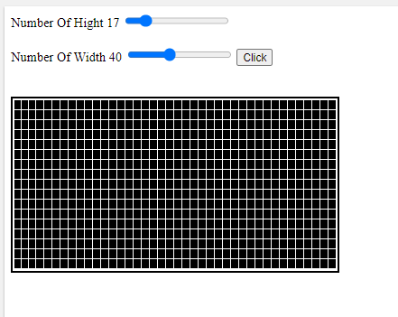

# Create-Table-Using-JS
enter 2 values hight and width of the table 

it can replce the table each time with new one 
I really Like this app if you didn't like it so you are noob can't understand it
